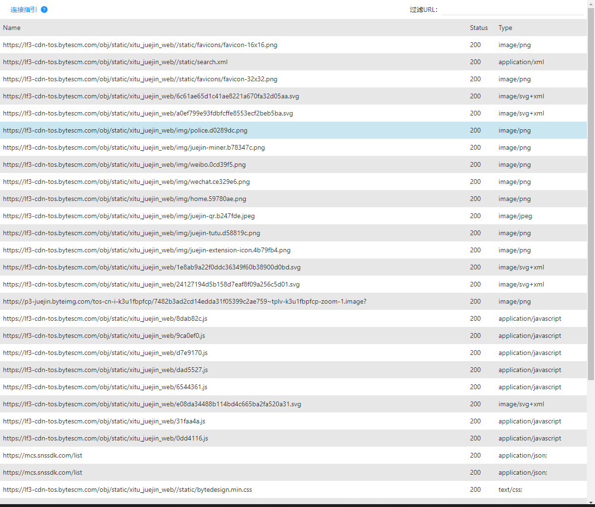
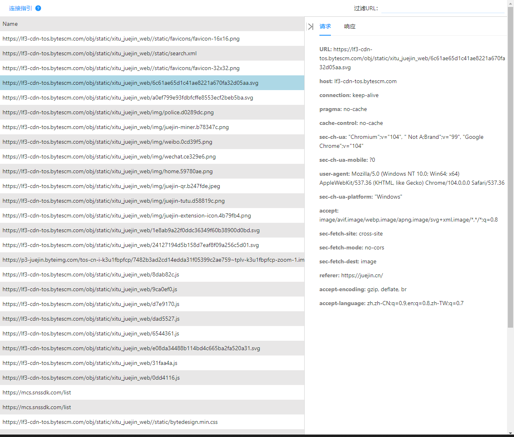
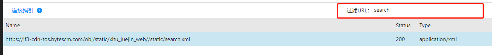

# v-proxy

简单易用的跨端 http/https 抓包工具

## 安装
```
    npm i -g v-proxy
    yarn add -g v-proxy
    pnpm i -g v-proxy
```

## 使用
```
    v-proxy [port = 8899] 

    port 抓包页面端口，默认 8899
```

## 功能展示



